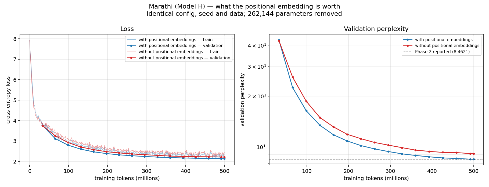
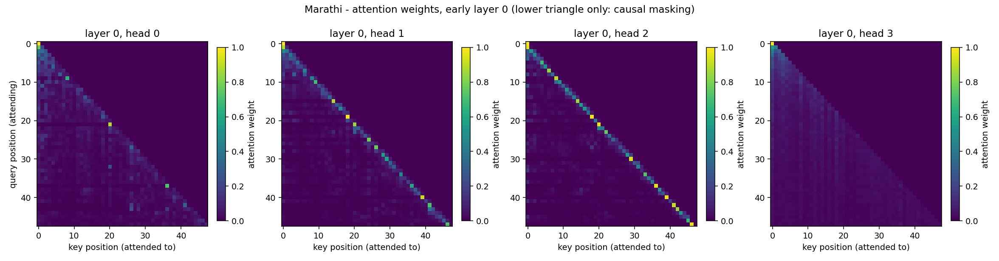
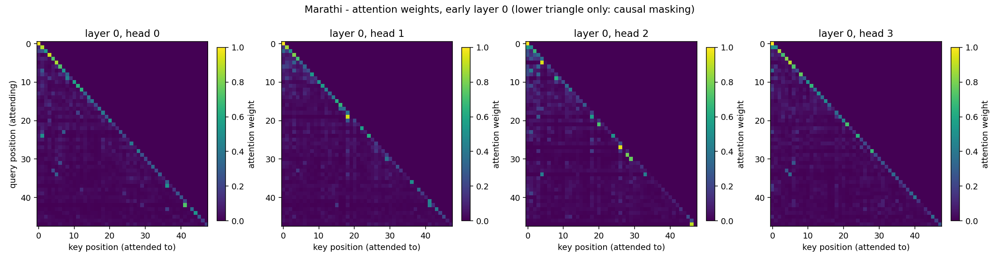
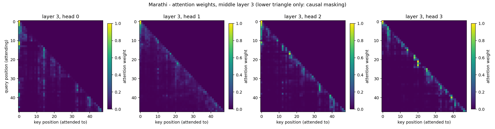
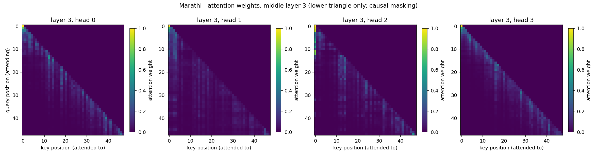
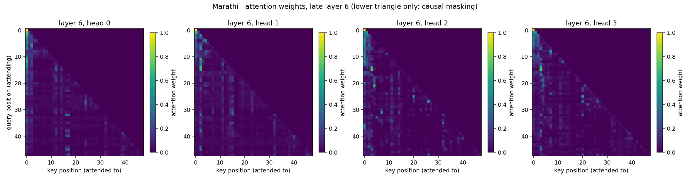

# Bonus — Marathi Without Positional Embeddings

An ablation of Phase 2 decision D-046. Model H (Marathi) was retrained from
scratch with the learned absolute positional embedding removed, alongside a
control retrained in the same session with it intact. Identical configuration,
seed, data and 500M-token budget; the only difference is 262,144 parameters.

One unattended run of `report/bonus_nope.ipynb` on Kaggle, 2 × Tesla T4, both
arms in parallel, 3.45 hours. Decisions, including the two mistakes made along
the way, are in `report/bonus_decisions.md` (B-001 to B-006).

The full Phase 2 evaluation suite was run on both arms. Where to find each part:

| Phase 2 evaluation component | here |
|---|---|
| perplexity, cross-entropy, bits per byte | §1 |
| BLEU, chrF, ROUGE-L at greedy and T = 0.5 / 1.0 / 1.5 | §6 |
| diversity diagnostics (distinct-1, distinct-2, repetition rate) | §6 |
| generated samples, qualitative notes | §6, §7 |
| attention heatmaps | `report/figures/bonus_attn_*` |
| attention entropy and mean distance, per head and layer | §5 |

---

## 1. Results

| | control | ablated | change |
|---|---:|---:|---:|
| parameters | 24,892,356 | 24,630,212 | −262,144 |
| validation loss | 2.1356 | 2.2131 | +0.0775 |
| **validation perplexity** | **8.4621** | **9.1439** | **×1.081** |
| test perplexity | 9.0846 | 9.8451 | ×1.084 |
| test cross-entropy (nats/token) | 2.2066 | 2.2870 | +0.0804 |
| **test bits per byte** | **0.4767** | **0.4941** | **+0.0174** |
| optimizer steps | 3,814 | 3,814 | — |
| wall clock | 3.45 h | 3.41 h | — |

**The control reproduced Phase 2 exactly: 8.4621 against 8.4621, to four decimal
places.** The ablation is therefore a comparison between two genuinely comparable
things, and the Phase 2 pretraining run is reproducible across sessions weeks
apart on different hardware allocations.

**Removing positional embeddings costs 8.1% perplexity.** That is far less than
we predicted, and §3 explains why.



*Validation perplexity for both arms over the 500M-token budget, with the Phase 2
Marathi result marked. The two curves separate by step 500 and never re-converge:
the gap at the end is the whole effect of the ablation.*

---

## 2. Ablation setup

**What was changed.** `ModelConfig` gained `no_positional_embedding`, default
`False`. When set, `DecoderLM` does not construct the positional embedding at
all — `self.position_embedding` is `None` and the forward pass is
`x = self.token_embedding(idx)` with nothing added. Everything else is untouched:
same 7 layers, `d_model` 512, 8 heads, FFN 2048, context 512, pre-norm, GELU,
dropout 0.1, untied head.

**Why removed rather than zeroed (B-002).** A zeroed `nn.Embedding` is still a
parameter tensor receiving gradient, and it would relearn a positional signal
within a few hundred steps. The run would then measure nothing while appearing to
work. Three checks assert the removal actually happened, and
`tools/verify_model.py --full --no-positional-embeddings` runs them alongside
every existing check:

| check | result |
|---|---|
| parameter count drops by exactly `context_length × d_model` | 24,892,356 → 24,630,212, a drop of 262,144 |
| the module is `None`, not a zeroed tensor | pass |
| no positional key survives in the state dict | pass |
| **total** | **24/24 ablated, 18/18 control** |

**What was held fixed.** Tokenizer and vocabulary (Phase 1, 2,500 pieces),
corpus and splits, AdamW with β = (0.9, 0.95), weight decay 0.1 on matrices only,
peak learning rate 3e-4 with 2% warmup and cosine decay to 10%, effective batch
131,072 tokens (32 × 512 × 8), gradient clipping at 1.0, mixed precision, and the
seed. Both arms ran in one session, one per T4.

**Why the control was retrained rather than reused (B-001).** The Phase 2
checkpoint already existed with exactly this configuration. Reusing it would have
cost nothing, but it was produced weeks earlier in a different Kaggle session —
a different machine allocation, possibly a different driver and library stack.
Any difference between the arms would then be confounded with whatever else
changed in between. Retraining leaves 262,144 parameters as the only difference,
and doubles as a reproducibility test.

**Checkpoint naming (B-003).** The ablated arm writes `pretrain_nope_best.pt`.
`train.py` resumes automatically when it finds a checkpoint, so a shared name
could let one arm silently continue the other's training under a mismatched
architecture.

---

## 3. What we predicted, and why it was wrong

B-004 recorded the prediction before the run, precisely so it could not be
rationalised afterwards. In outline:

> Removing positional embeddings should hurt badly. Self-attention is
> permutation invariant […] It should not be total, because causal masking leaks
> position […] What would falsify our understanding: an ablated perplexity close
> to the control — say within 10% — would mean the learned embedding was
> contributing almost nothing over the causal mask's leak.

The measured cost is **8.1%**. The falsification condition fired.

The prediction had the mechanism right and the magnitude badly wrong. We expected
the causal mask's leak to be a weak residual signal with the learned embedding
doing most of the work. It is the other way round: the mask carries almost all of
the usable positional information at this scale, and the 262,144-parameter
embedding is worth about 0.08 nats per token on top of it.

The initialisation probe that motivated the prediction — permuting a 16-token
input moves an untrained ablated model's last-position logits by 1.15 — was
evidence that the leak *exists*. We read it as evidence that the leak was small.
It was not evidence about magnitude at all.

---

## 4. How the gap develops during training

Validation perplexity, ablated ÷ control, as tokens accumulate:

| tokens seen | control | ablated | ratio |
|---:|---:|---:|---:|
| 33M | 42.95 | 42.65 | 0.993 |
| 66M | 22.50 | 25.95 | **1.153** |
| 131M | 13.45 | 14.95 | 1.112 |
| 262M | 9.75 | 10.64 | 1.092 |
| 393M | 8.75 | 9.42 | 1.077 |
| 500M | 8.46 | 9.14 | 1.081 |

At 33M tokens the two are indistinguishable — neither has learned anything
positional yet, and the ablated arm is marginally *ahead*. The gap opens to its
widest, 15.3%, at 66M tokens, then closes steadily to 8% and flattens.

That shape is the finding. The control gets positional information for free at
the input and can use it immediately. The ablated model has to construct it, and
the first third of training is largely spent doing so. Once it has, it recovers
about half the gap and then tracks the control at a constant offset.

---

## 5. Where the positional information comes from instead

Per-layer attention statistics, 32 sequences of 256 tokens from the test split.

| layer | entropy, control | ablated | change | mean distance, control | ablated | change |
|---:|---:|---:|---:|---:|---:|---:|
| 0 | 5.044 | 5.788 | **+0.744** | 30.61 | 59.26 | **+28.65** |
| 1 | 5.060 | 5.945 | **+0.885** | 31.55 | 57.66 | **+26.11** |
| 2 | 3.902 | 5.650 | **+1.749** | 11.50 | 34.80 | **+23.30** |
| 3 | 2.956 | 3.807 | +0.851 | 7.95 | 7.74 | −0.21 |
| 4 | 3.911 | 3.213 | **−0.698** | 18.08 | 11.13 | **−6.95** |
| 5 | 3.957 | 4.297 | +0.340 | 51.07 | 32.98 | **−18.09** |
| 6 | 5.039 | 4.863 | −0.176 | 43.84 | 45.73 | +1.89 |
| **all 56 heads** | **4.267** | **4.795** | **+0.528** | **27.80** | **35.62** | **+7.81** |

The most local and most global heads also move: the control's sharpest head
attends 2.39 positions on average (L3H7) and its widest 92.10 (L1H7); the
ablated model's are 4.49 (L3H5) and 72.53 (L1H1). The dynamic range narrows.

The reorganisation is systematic, and it runs in opposite directions at the two
ends of the stack.

**Layers 0–2 become far more diffuse.** Entropy rises by up to 1.75 bits and mean
attention distance roughly doubles or triples. Phase 2's Model H used its early
layers for local work — layer 2 averaged 11.5 positions. Without a positional
signal at the input, an early head cannot form a local window, because "nearby"
is not yet a thing the representation knows about. So the early layers do a
broad, undirected aggregation pass instead.

**Layers 4 and 5 become markedly more local.** Layer 4's entropy *falls* by 0.70
bits — the only layer in either model to sharpen — and its attention distance
drops from 18.1 to 11.1 positions. Layer 5 drops from 51.1 to 33.0.

**Layer 3 is the hinge.** Its attention distance is essentially unchanged, 7.95
against 7.74, in a stack where everything above and below it moved by 7 to 29
positions.

Read together: the ablated model reconstructs locality in the middle of the
network rather than receiving it at the input. The causal mask's leak is not a
signal that can be read off directly — position *t* attends over exactly *t+1*
tokens, and turning that count into something usable takes computation. The model
spends its first two or three layers doing that, and only then can it do the
local work the control's layer 2 was already doing.

The cost is visible in the budget: three layers partly spent recovering what
262,144 parameters would have supplied for free, which is what an 8% perplexity
gap in a seven-layer model looks like.

Heatmaps for layers 0, 3 and 6 in both conditions. Layer 0 is where the two
architectures differ most visibly — the control has already formed a local
diagonal band, the ablated model has not:

| | control (positions on) | ablated (positions removed) |
|---|---|---|
| layer 0 |  |  |
| layer 3 |  |  |
| layer 6 |  |  |

The uniformly black upper triangle in every panel is the causal mask, drawn
directly — and it is also the residual positional signal §3 is about.

---

## 6. Generation — the full evaluation suite

Same protocol as Phase 2 §5: 64 held-out prefixes, 128 new tokens, greedy plus
temperatures 0.5, 1.0 and 1.5, scored against the held-out continuations.

| setting | arm | BLEU-4 | chrF | ROUGE-L | distinct-1 | distinct-2 | 4-gram repetition |
|---|---|---:|---:|---:|---:|---:|---:|
| greedy | control | 5.17 | 22.75 | 11.19 | 0.092 | 0.235 | 0.672 |
| greedy | **ablated** | 5.81 | 22.31 | 11.91 | 0.082 | 0.203 | **0.723** |
| T = 0.5 | control | 6.04 | **25.42** | 11.73 | 0.129 | 0.402 | 0.412 |
| T = 0.5 | **ablated** | 4.48 | **21.88** | 10.55 | 0.112 | 0.331 | **0.515** |
| T = 1.0 | control | 3.62 | 26.05 | 9.00 | 0.178 | 0.702 | 0.098 |
| T = 1.0 | ablated | 3.61 | 25.67 | 9.39 | 0.183 | 0.706 | 0.101 |
| T = 1.5 | control | 0.39 | 20.86 | 3.04 | 0.221 | 0.916 | 0.004 |
| T = 1.5 | ablated | 0.00 | 21.56 | 3.35 | 0.227 | 0.927 | 0.004 |

**Reading the reference metrics.** BLEU and ROUGE-L move by less than two points
in both directions and cross over between settings — the ablated model is
nominally ahead at greedy and behind at T = 0.5. They are not measuring the
ablation. Phase 2 §5 recorded why: against a single reference continuation, an
open-ended generation that is fluent and different scores the same as one that is
broken and different. chrF is the more sensitive of the three because it works on
character n-grams, and it does show the effect at T = 0.5 (25.42 → 21.88).

**The diversity diagnostics are where the ablation shows.** 4-gram repetition
rises from 0.672 to 0.723 greedily and from 0.412 to 0.515 at T = 0.5, while
distinct-2 falls from 0.402 to 0.331 and unique bigrams from 3,270 to 2,690. At
T = 1.0 and 1.5 the two models are indistinguishable on every diversity measure.

That temperature dependence is the signal, not noise. Sampling noise substitutes
for the structure the ablated model cannot supply itself; remove the noise and
the deficit appears.

### Generated samples

Greedy, first two held-out prefixes. Prompts truncated for width.

**Prompt 1** — `भाजपा हा राष्ट्रवादी काँग्रेसची नवी झेरॉक्स प्रत असल्याचा खळबळजनक आरोप…`

| arm | continuation |
|---|---|
| control | …नेही भाजपला पाठिंबा दिला. गोटे यांनीही गोटे यांना पाठिंबा दिला. गोटे यांनी गोटे यांना पाठिंबा दिला. गोटे यांना पाठिंबा देण्यासाठी… |
| ablated | …ने या प्रकरणाची चौकशी केली. मुंबई : पोलीसनामा ऑनलाइन – मुंबईतील एका खासगी रुग्णालयात कोरोनाबाधित रुग्णांची संख्या वाढत आहे… |

**Prompt 2** — a numbered government circular, `थापि, संचालक, प्राथमिक शिक्षण…`

| arm | continuation |
|---|---|
| control | …चे काम हाती घेण्यात यावे. ४. या योजनेंतर्गत मंजूर करण्यात आलेल्या अनुदानापेक्षा जास्त खर्च होणार नाही याची दक्षता घेण्यात यावी. ५. … |
| ablated | …चे काम हाती घेण्यात येतील. ४. या योजनेंतर्गत लाभार्थ्यांना **लाभार्थी लाभार्थी लाभार्थी लाभार्थी लाभार्थी लाभार्थी लाभार्थी…** |

At T = 0.5 on a tabular OCR'd prompt (`Canon LBP 2800 Toner … 900,00 | 30,0`):

| arm | continuation |
|---|---|
| control | `00 \| Canon LBP ° \| AMJ Kadhade State Date: 2012.08.24 … (समीर देशमुख) उप सचिव, महाराष्ट्र शासन` |
| ablated | `,00 \| \| 800,00 \| 30,00 \| \| Cost \| \| \| Sub Total \| \| Sub Total \| \| Sub Total \| \| Sub Total \|…` |

**Qualitative notes.** Both models are locally fluent: the ablated model's
Marathi is grammatical, its script is correct, and its clause structure is
well-formed. Nothing about it reads as a broken language model at the scale of a
few words. The failures are all at the scale of a span.

Prompt 2 is the clearest case. The control continues a numbered circular and
correctly advances the numbering — `४.` then `५.` — producing a plausible clause
under each. The ablated model reaches item `४.` and then emits लाभार्थी
("beneficiary") eleven times in a row. It has the right word and no idea how many
times it has already said it.

The Canon sample is the same failure in a different genre: the control recognises
the document is ending and produces a signature block; the ablated model emits
`| Sub Total |` six times, unable to track where it is in the table.

Prompt 1 shows the converse, and is worth noting because it cuts against the
ablation: the *control* is the one that loops here
(`गोटे यांना पाठिंबा` repeatedly), while the ablated model produces a coherent
topic shift into a news template. At 25M parameters both models degenerate; the
ablation makes it more frequent, not categorically new.

---

## 7. What breaks without position information

The specification asks for a short explanation of this. Four things, in the order
the evidence supports them.

**1. Nothing catastrophic breaks.** This is the first and most important result.
A decoder-only Transformer with no positional information whatsoever still trains
to within 8.1% of its own perplexity and produces grammatical, correctly-scripted
Marathi. The textbook argument — self-attention is permutation invariant, so
without positions the model cannot distinguish "dog bites man" from "man bites
dog" — is true of *bidirectional* self-attention and false of a causal decoder.

**2. What replaces it is the causal mask.** Position *t* attends over exactly
*t + 1* tokens and position 0 over one, so the number of visible positions is
itself a positional signal. It is present before any training: permuting a
16-token input changes an untrained ablated model's last-position logits by 1.15.
It is not free to use, though — it is a *count*, not a coordinate, and turning it
into something the network can condition on takes layers.

**3. What is lost is cheap locality, and it is paid for in depth.** The control
receives position at the input and can form local windows in layer 2, which
averages 11.5 positions. The ablated model's early layers cannot do this and go
diffuse instead (§5: layers 0–2, entropy up to +1.75 bits, distance roughly
tripled), with locality reappearing only at layers 4–5, where layer 4 is the only
layer in either model whose entropy *falls*. Three of seven layers are partly
spent reconstructing what an embedding would have supplied. The 8.1% gap is the
price of that reallocation, and the training curve shows it being paid: the gap
is widest at 66M tokens (15.3%) and halves by the end as the reconstruction gets
built.

**4. What breaks behaviourally is tracking position within a span.** The model
knows what word comes next and not how many times it has already said it. Greedy
4-gram repetition rises from 0.672 to 0.723; at T = 0.5 from 0.412 to 0.515;
unique bigrams fall by 18%. In the samples this is eleven consecutive
लाभार्थी and six consecutive `| Sub Total |`. The effect vanishes at T = 1.0,
because sampling noise supplies the variation the model's own representation
cannot. Counting repetitions is exactly the operation a position signal supports
and an aggregate-over-visible-tokens signal does not: the causal mask tells the
model how far into the *sequence* it is, not how far into the *phrase*.

So the honest summary is that removing positional embeddings does not break the
language model — it makes it shallower in effect than in parameter count, and
measurably worse at not repeating itself.

---

## 8. What this says about D-046

D-046 chose learned absolute embeddings over sinusoidal and spent 262,144
parameters — 1% of the budget — on them. This ablation says that purchase bought
**8.1% perplexity and a measurable reduction in degenerate repetition**, and that
the alternative is not a broken model but a slower-learning, more repetitive one
that reorganises three of its seven layers to compensate.

Whether that is a good trade depends on what the parameters would otherwise buy.
262,144 parameters is about one twelfth of a transformer block, so the honest
comparison is 8.1% perplexity against a twelfth of a layer — and on that
comparison D-046 was clearly right. The decision is not vindicated by the
ablation being catastrophic; it is vindicated by being cheap.

The result also shows the decision mattered less than the Phase 2 reasoning
implied. D-046 argued from permutation invariance. That argument is right about
the conclusion and wrong about the reason, and §5 shows exactly how the causal
version gets around it.

---

## 9. Limitations

**One language, one seed.** Marathi only, one run per arm. Run-to-run variance is
not measured, so 8.1% is one measurement rather than an estimate with an
interval. The direction is not in doubt — the gap is present at every evaluation
point from 66M tokens onward — but the magnitude is a single sample.

**One budget.** At 500M tokens the gap was still narrowing slightly. A longer run
might close it further; the ablated model was still learning positional structure
when the schedule ended.

**Attention statistics are averages over 32 sequences.** The per-layer story in
§5 is consistent and large — for comparison, the same measurement moved by 0.05
bits across Phase 3's finetuning — but 32 sequences is a small sample for claims
about individual heads, and §5 makes claims only about layer means.

**64 prompts is a small generation sample.** Enough for the repetition finding,
which is large and temperature-ordered, and not enough for confidence intervals
on BLEU.

**The smoke test did not test the ablation (B-006).** Both smoke arms printed
identical losses because `train.py` rebuilt the model config under `--smoke`
without carrying the flag. It was fixed after the run started; the ablation was
confirmed instead from the parameter counts in the two training logs
(24,630,212 against 24,892,356) and from `verify_model.py --full
--no-positional-embeddings` passing 24/24 beforehand.

---

## 10. Reproduction

```
# Verify the ablated architecture before spending the compute
python3 tools/verify_model.py --full --no-positional-embeddings   # 24/24
python3 tools/verify_model.py --full                              # 18/18

# Both arms, one per GPU, identical everything except the flag
python3 tools/train.py --language marathi --max-tokens 500000000 --device cuda \
  --data-dir marathi/data/packed --out-dir out/control

python3 tools/train.py --language marathi --max-tokens 500000000 --device cuda \
  --no-positional-embeddings \
  --data-dir marathi/data/packed --out-dir out/ablated

# The full Phase 2 evaluation suite on each arm
python3 tools/evaluate.py --language marathi --split test \
  --checkpoint out/ablated/pretrain_nope_best.pt \
  --tokenizer marathi/tokenizer/marathi_bpe.model

python3 tools/attention_analysis.py --language marathi --split test \
  --checkpoint out/ablated/pretrain_nope_best.pt \
  --tokenizer marathi/tokenizer/marathi_bpe.model
```

The whole ablation runs unattended from `report/bonus_nope.ipynb` as a Kaggle
batch commit with `lma-bonus-code` and `lma-phase2-data` attached. It takes no
input while running. Step-by-step setup is in `report/bonus_runbook.md`.

---

## 11. Deliverables

| file | what |
|---|---|
| `common/model/config.py` | `no_positional_embedding`, default False |
| `common/model/lm.py` | the module is `None` when ablated, not zeroed |
| `tools/train.py` | `--no-positional-embeddings`, separate run name |
| `tools/verify_model.py` | three checks that the removal happened, plus every existing check against the ablated architecture |
| `report/bonus_nope.ipynb` | the run that produced every number here |
| `report/bonus_runbook.md` | how to run it |
| `report/bonus_decisions.md` | B-001 to B-006, including what failed |
| `report/bonus_summary.json` | both arms, full validation curves |
| `report/bonus_eval_{control,ablated}.json` | intrinsic and generation metrics, and the generated samples of §6 |
| `report/bonus_{control,ablated}_log.csv` | per-step training logs |
| `report/bonus_attn_{control,ablated}_marathi.json` | per-head entropy and distance |
| `report/figures/bonus_loss.png` | both curves, with the Phase 2 line |
| `report/figures/bonus_attn_*_layer{0,3,6}.png` | attention heatmaps, both conditions |

Both checkpoints are on Google Drive with the Phase 2 and Phase 3 ones; they are
not in the repository.
